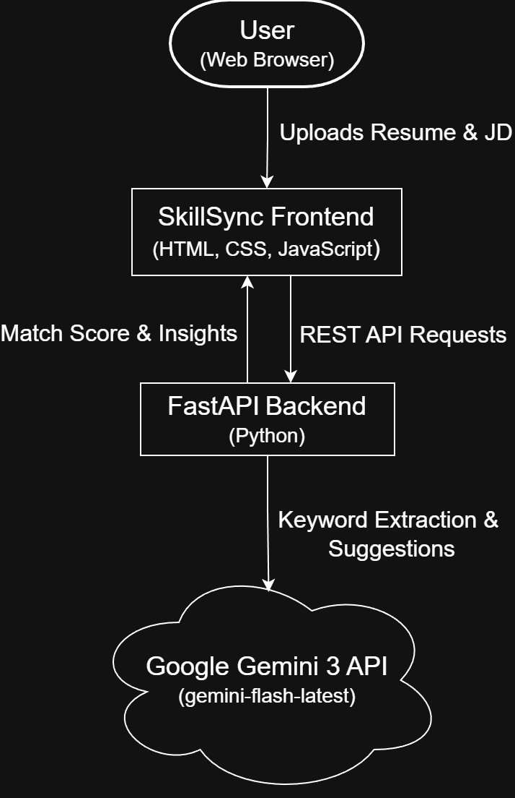

# SkillSync

SkillSync is an AI-powered resume analysis tool that helps job seekers optimize their resumes for Applicant Tracking Systems (ATS). It compares resumes with job descriptions, identifies missing technical keywords commonly used by ATS systems, and provides actionable improvement suggestions using the **Gemini 3 API**.

---

## Inspiration

Modern hiring pipelines rely heavily on Applicant Tracking Systems that filter resumes based on keyword matching. Many qualified candidates are rejected simply because their resumes lack specific technical terms mentioned in job descriptions, even when they possess the required skills.

SkillSync was built to bridge this gap by helping candidates understand *why* their resume may not be matching a role and *how* they can improve it using AI-driven insights.

---

## What It Does

SkillSync allows users to:

- Upload a PDF resume
- Paste a job description
- Extract **pure technical keywords** from the job description using Gemini 3
- Analyze resumes to identify **matched and missing skills**
- Calculate an **ATS-style match score**
- Generate **AI-powered, actionable resume improvement suggestions**
- Maintain a **privacy-first approach** (resume text is processed client-side)

---

## Gemini 3 API Usage

SkillSync uses the **Google Gemini 3 API** (via the `gemini-flash-latest` model) for:

- Extracting clean, technical keywords from job descriptions
- Generating contextual and actionable resume improvement suggestions

To ensure reliability and avoid hallucinations, all keyword-to-resume matching is performed **deterministically in Python**, while Gemini 3 is used only where generative intelligence adds value.

---

## How We Built It

- **Frontend:** HTML, CSS, JavaScript  
- **Backend:** Python with FastAPI  
- **AI:** Google Gemini 3 API  
- **Resume Parsing:** PDF.js  
- **Visualization:** Chart.js  
- **Communication:** REST APIs with JSON  

The frontend handles resume parsing, user interaction, and visualization.  
The backend focuses on analysis logic and integrates with Gemini 3 for AI-powered keyword extraction and suggestions.

---

## System Architecture



**Flow Overview:**

1. The user uploads a resume and job description via the web interface.
2. The frontend sends REST API requests to the FastAPI backend.
3. The backend:
   - Uses Gemini 3 to extract technical keywords and generate suggestions.
   - Performs deterministic keyword matching and scoring.
4. Results are returned to the frontend and visualized for the user.

---

## How to Run Locally

1. Clone this repository
2. Create a `.env` file inside the `backend` folder:

```bash
GEMINI_API_KEY=your_api_key_here

